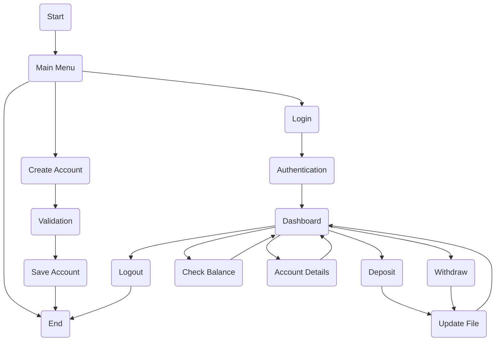

# 🔄 Bank Management System Flowcharts

This document contains the complete workflow of the Bank Management System.

---

# 📌 Overall Project Flow

```text
                Start
                   │
                   ▼
          Display Main Menu
                   │
        ┌──────────┼──────────┐
        │          │          │
        ▼          ▼          ▼
 Create Account   Login      Exit
        │          │
        ▼          ▼
 Validation   Authentication
        │          │
        ▼          ▼
 Save Account  Dashboard
                    │
      ┌─────────────┼──────────────┐
      │             │              │
      ▼             ▼              ▼
 Deposit       Withdraw      Check Balance
      │             │              │
      ▼             ▼              ▼
Update File   Update File    Show Balance
      │             │
      └──────┬──────┘
             ▼
        Account Details
             │
             ▼
          Logout
             │
             ▼
            End
```

---

# 🏦 Create Account Flow

```text
Start
  │
  ▼
Input Name
  │
  ▼
Valid?
 │
 ├── No
 │     │
 │     ▼
 │ Show Error
 │     │
 │     └────► Input Again
 │
 └── Yes
        │
        ▼
Input Account Number
        │
        ▼
Valid?
 │
 ├── No
 │     │
 │     ▼
 │ Show Error
 │     │
 │     └────► Input Again
 │
 └── Yes
        │
        ▼
Input PIN
        │
        ▼
Valid?
 │
 ├── No
 │     │
 │     ▼
 │ Show Error
 │     │
 │     └────► Input Again
 │
 └── Yes
        │
        ▼
Input Initial Balance
        │
        ▼
Valid?
 │
 ├── No
 │     │
 │     ▼
 │ Show Error
 │     │
 │     └────► Input Again
 │
 └── Yes
        │
        ▼
Create Object
        │
        ▼
Save Account
        │
        ▼
Success
```

---

# 🔐 Login Flow

```text
Start
   │
   ▼
Enter Account Number
   │
   ▼
Enter PIN
   │
   ▼
Search File
   │
   ▼
Account Found?
 │
 ├── No
 │      │
 │      ▼
 │ User Not Found
 │
 └── Yes
        │
        ▼
Create currentUser Object
        │
        ▼
Dashboard
```

---

# 💰 Deposit Flow

```text
Deposit
   │
   ▼
Enter Amount
   │
   ▼
Valid?
 │
 ├── No
 │      │
 │      ▼
 │ Show Error
 │      │
 │      └────► Input Again
 │
 └── Yes
        │
        ▼
Balance = Balance + Amount
        │
        ▼
Update File
        │
        ▼
Display New Balance
```

---

# 💸 Withdraw Flow

```text
Withdraw
    │
    ▼
Enter Amount
    │
    ▼
Valid?
 │
 ├── No
 │      │
 │      ▼
 │ Show Error
 │      │
 │      └────► Input Again
 │
 └── Yes
        │
        ▼
Balance Sufficient?
 │
 ├── No
 │      │
 │      ▼
 │ Insufficient Balance
 │
 └── Yes
        │
        ▼
Balance = Balance - Amount
        │
        ▼
Update File
        │
        ▼
Display Current Balance
```

---

# 💳 Check Balance Flow

```text
Dashboard

    │

    ▼

Check Balance

    │

    ▼

Read currentUser.balance

    │

    ▼

Display Balance
```

---

# 👤 Account Details Flow

```text
Dashboard

    │

    ▼

Account Details

    │

    ▼

Display

Name

Account Number

Balance
```

---

# 📂 File Handling Flow

```text
User Transaction

      │

      ▼

Update currentUser Object

      │

      ▼

Read accounts.txt

      │

      ▼

Create temp.txt

      │

      ▼

Copy All Records

      │

      ▼

Replace Current User Record

      │

      ▼

Delete Old File

      │

      ▼

Rename temp.txt

      │

      ▼

accounts.txt Updated
```

---

# 🏗️ Class Interaction

```text
                Main.java
                    │
    ┌───────────────┼────────────────┐
    │               │                │
    ▼               ▼                ▼
Validation     Dashboard      TransactionManager
                                        │
                                        ▼
                                 FileManager
                                        │
                                        ▼
                                  accounts.txt
```

---

# 🚀 Mermaid Diagram



---

# 📌 Workflow Summary

- User creates an account.
- Account is validated.
- Data is stored in `accounts.txt`.
- User logs in using Account Number and PIN.
- Login creates the `currentUser` object.
- Dashboard allows banking operations.
- Deposit and Withdraw update both memory and file.
- Check Balance and Account Details use the `currentUser` object.
- Logout ends the user session.