# 📊 Expense Tracker - Flowcharts

> **Project:** Expense Tracker  
> **Language:** Java  
> **Developer:** ⭐ ANSH ⭐

---

# 🏗 Overall Project Architecture

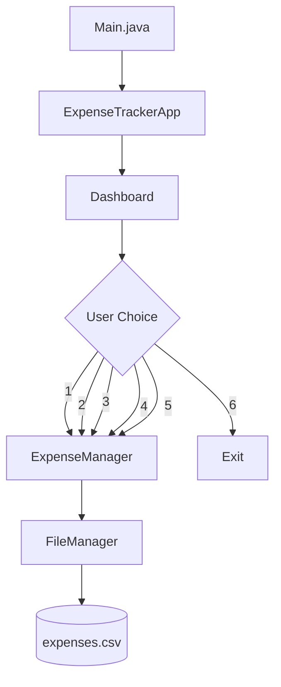

---

# 📂 Add Expense Flow

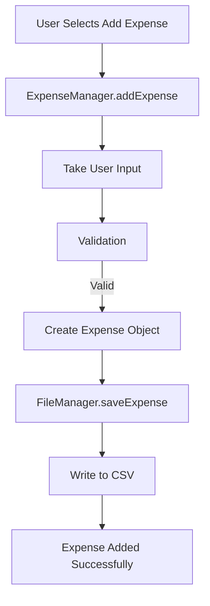

---

# 📖 View Expense Flow

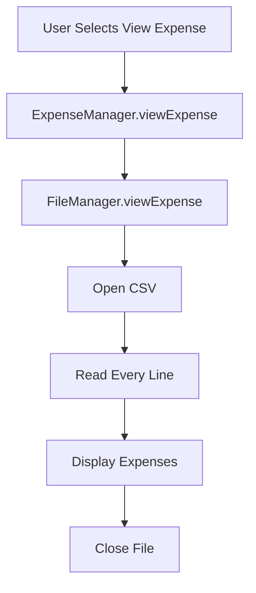

---

# 🔍 Search Expense Flow

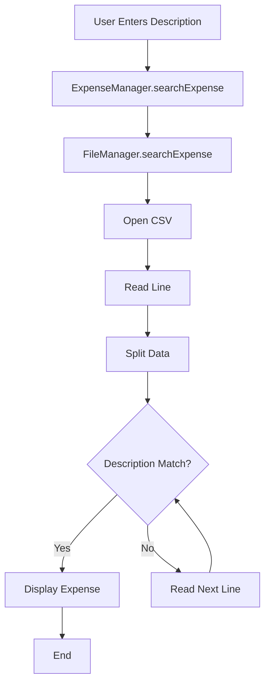

---

# 🗑 Delete Expense Flow

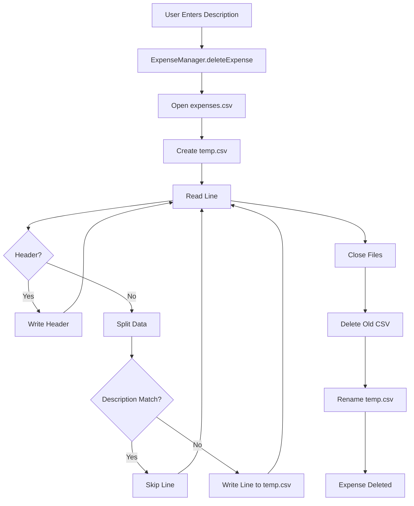

---

# 💰 Total Expense Flow

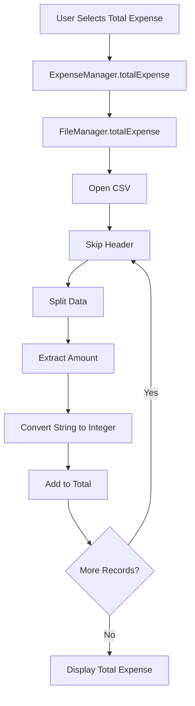

---

# 💾 Save Expense Workflow

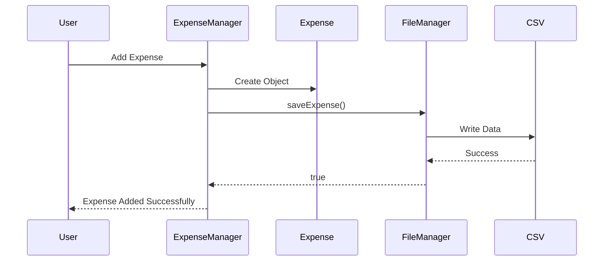

---

# 🗑 Delete Workflow

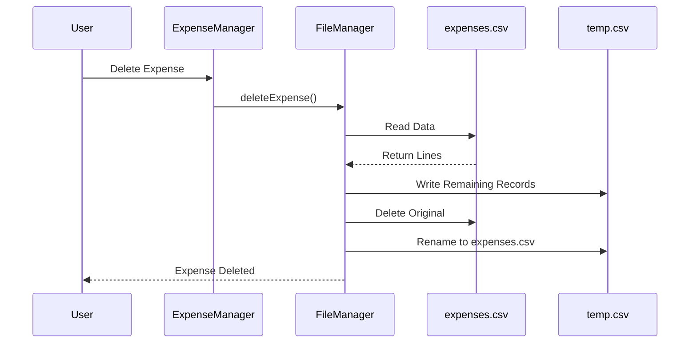

---

# 🏛 Project Layer Architecture

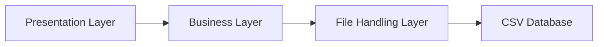

---

# 📦 Class Relationship Diagram

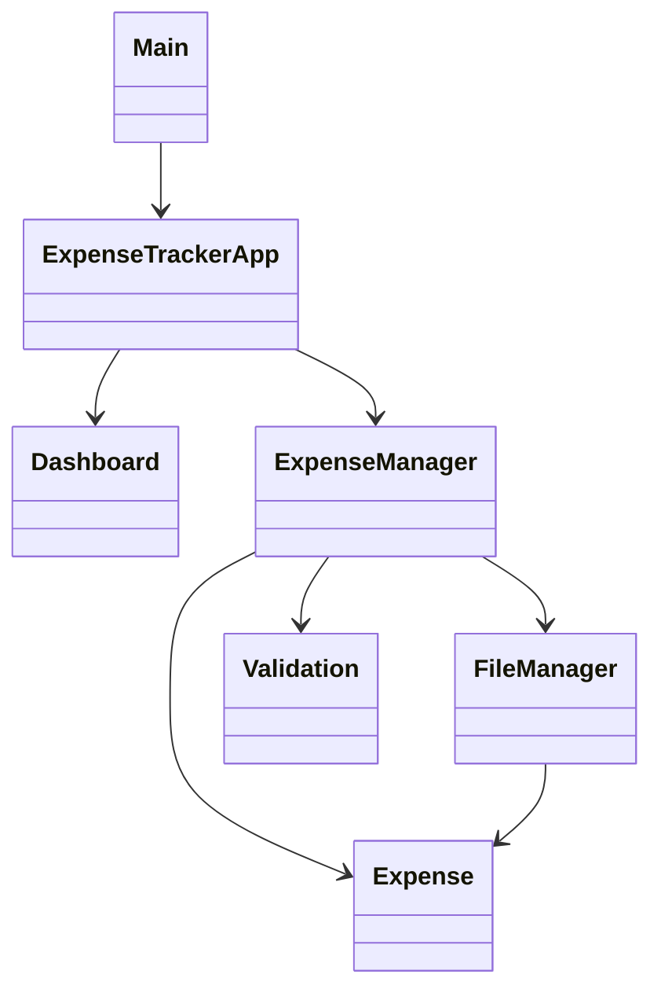

---

# 🚀 Future Version Roadmap

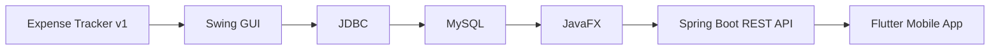

---

# 👨‍💻 Developed By

# ⭐ ANSH ⭐

> **"Good developers write code. Great developers document their code." 🚀**