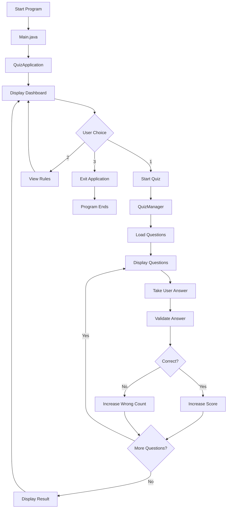
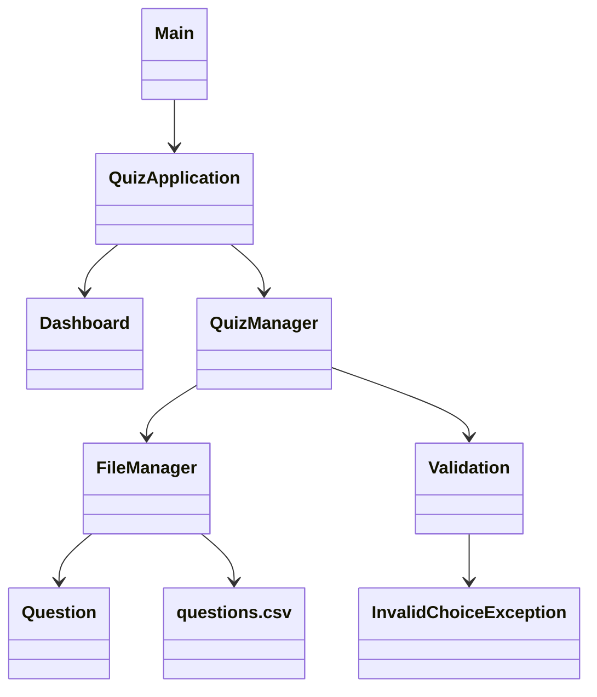
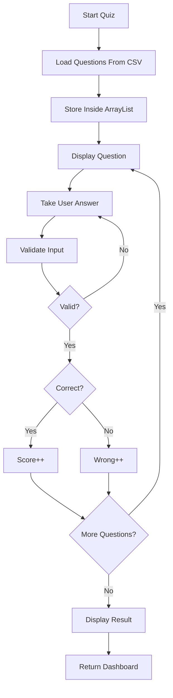
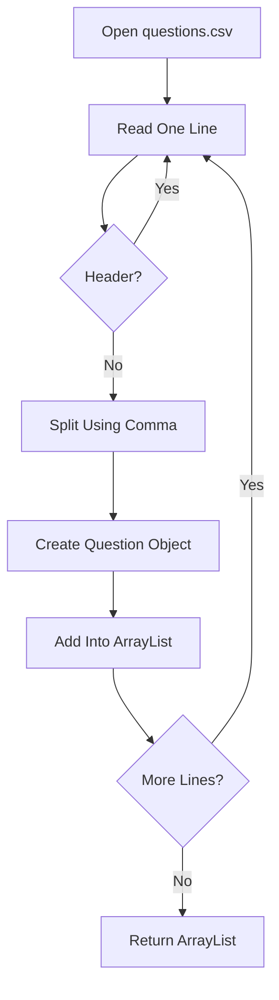
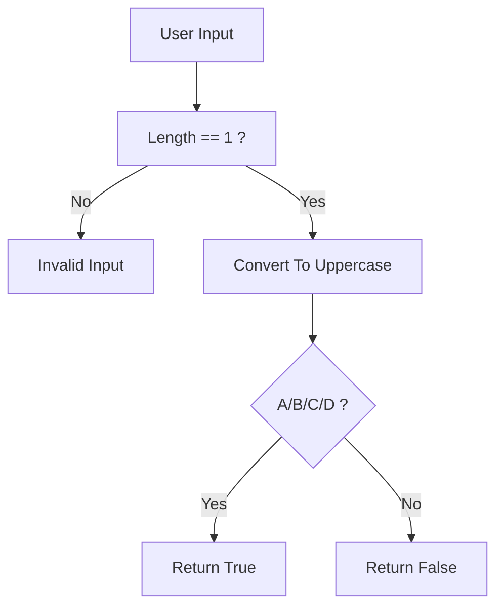
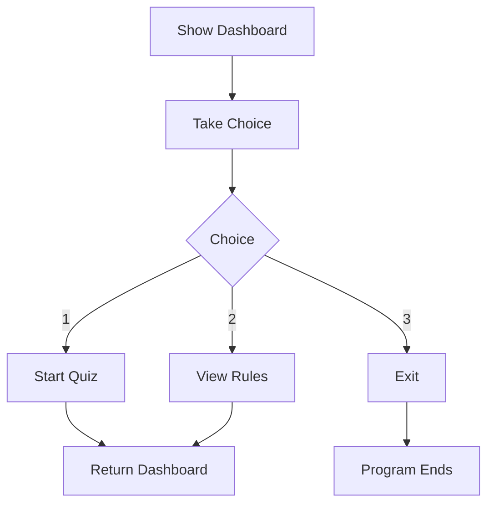
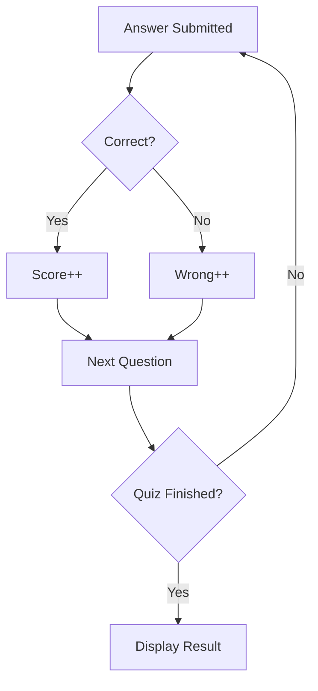
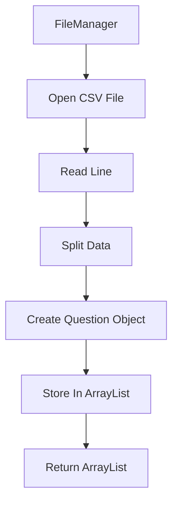
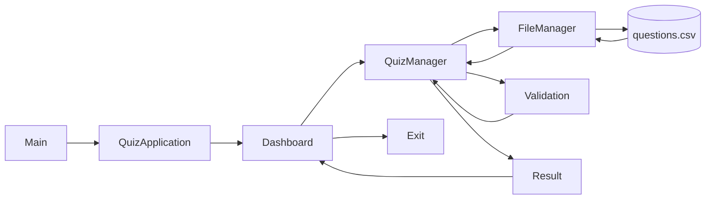

# 📊 Quiz Application - Flowcharts

---

# 📌 Project Overview Flow

---

# 📌 Class Interaction Diagram

---

# 📌 Quiz Execution Flow

---

# 📌 CSV Loading Flow

---

# 📌 Validation Flow

---

# 📌 Dashboard Flow

---

# 📌 Result Calculation Flow

---

# 📌 File Handling Flow

---

# 📌 Complete Application Flow

---

# 🎯 Summary

The application follows a modular architecture where every class has a single responsibility.

- **Main.java** starts the application.
- **QuizApplication.java** controls the application flow.
- **Dashboard.java** interacts with the user.
- **QuizManager.java** manages quiz execution.
- **FileManager.java** handles CSV file operations.
- **Validation.java** validates user input.
- **Question.java** represents each quiz question as an object.
- **InvalidChoiceException.java** handles invalid menu choices.

This architecture makes the project easy to understand, maintain, and extend with future features.